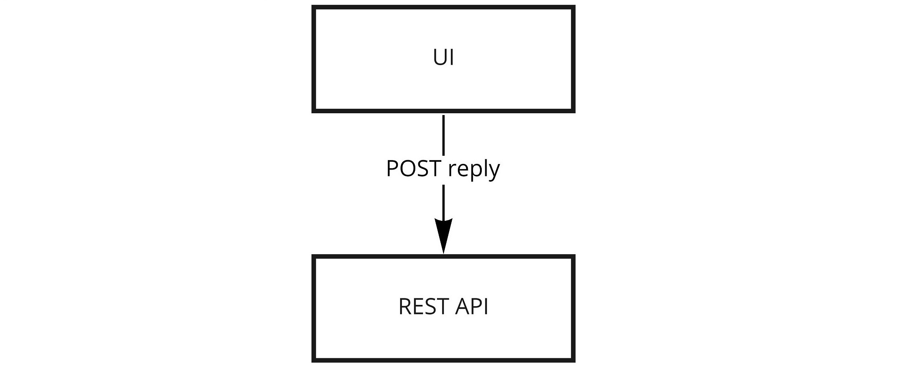

# Jadwiga - High Level Architecture

Jadwiga as a web application comprises two main components:
- UI-providing frontend application,
- backend service.

Source: [[Miro](https://miro.com/app/board/o9J_lA6r_fQ=/?moveToWidget=3074457359772091182&cot=14)]

## Frontend application

Frontend application works in a web browser and serves as a User Interface.

## Backend service

Backend service is a REST API and provides data for the frontend application.
